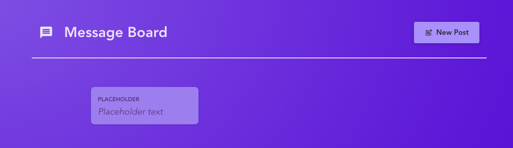
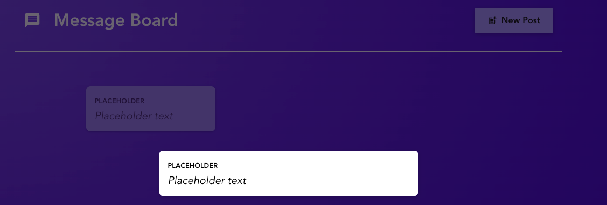
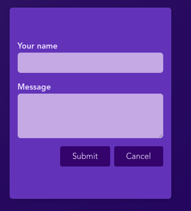

# **React MessageBoard**

## <ins>Summary</ins>

This is a Message board built using React with Vite, React-Router-Dom. You are able to create posts, see all posts and view a single post.
React Router DOM has been configured with the routes to create a new post and view a single post.

The purpose of this project was to widen my knowledge of React and gain an understanding of React Router DOM as well as Vite.

The posts are handled by an API which can be found [here](https://github.com/mandeep-s1ngh/react-messageboard-api) along with the instructions to get it up and running.

---

## <ins>Screenshots</ins>

---

## <ins>Tech Stack</ins>

- React
- React Router DOM
- Vite

---

## <ins>Local Setup</ins>

1. To clone the repo, open up your terminal and run `https://github.com/mandeep-s1ngh/react-message-board.git` - once you have it cloned, move the folder to your usual directory for projects (if necessary).

2. You can then open up the folder in your code editor of choice and run `npm install` to all the dependencies.

3. Then run `npm run dev`. This will start the app and keep it running in the background.

4. You can then run the Messageboard API project in tandem to keep the functionality of the front end working. All the posts are stored in the posts.json file of that repo. There is already one post in there to get you started.
